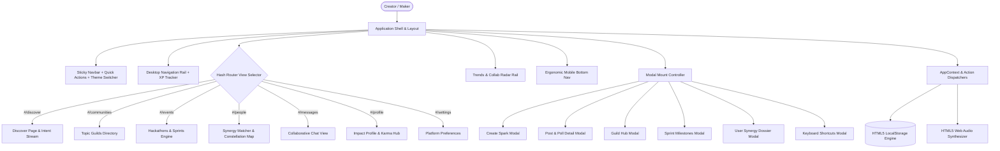

# 🏛️ SYNAPSE Architecture & Technical Blueprint

This document details the high-level architecture, module decomposition, state persistence, routing design, and accessibility guarantees of **SYNAPSE — Reimagine Social**.

---

## 1. System Overview & Core Tenets

SYNAPSE is an ultra-performant, client-first social platform engineered to eliminate passive doomscrolling by refocusing interactions on:
- **Collaborative Action Sparks**: Purpose-driven contributions (Ideation, Inquiries, Proof of Work, Interactive Polls).
- **Domain Guilds & Laboratories**: Curated micro-communities centered on active craftsmanship.
- **Participatory Challenges & Hackathons**: Time-boxed sprint events with tangible milestones.
- **Skill Synergy Matchmaking**: Algorithmic pairing based on complementary capabilities ("Skills Offered" ↔ "Skills Needed").



---

## 2. Component Hierarchy & Layering

The codebase enforces clean separation of concerns across 5 architectural tiers:

1. **Entry & Shell Tier** (`main.jsx`, `App.jsx`):
   Mounts the global providers, error boundary, suspense fallback, sticky header, responsive stage, and global dialog hub.

2. **State & Persistence Tier** (`src/context/AppContext.jsx`, `src/hooks/useLocalStorage.js`):
   Central state container providing deterministic dispatchers, reactive local storage sync, and custom URL hash routing synchronization.

3. **Page Views Tier** (`src/pages/`):
   Autonomous top-level views (`DiscoverPage`, `CommunitiesPage`, `EventsPage`, `PeoplePage`, `ExplorePage`). Lazily loaded with code-split production bundles.

4. **Component Domain Tier** (`src/components/`):
   - `common/`: Navbar, Sidebar, MobileNav, RightRail, Modal, Footer, Toasts, PageSkeleton, KeyboardShortcutsModal.
   - `constellation/`: 2D SVG dynamic force-directed graph with pan, zoom, and live region announcements.
   - `people/`: CollabRadar algorithm engine, PersonCard, ProfileDetailModal.
   - `feed/`: PostCard, FilterBar, CreatePostModal, PostDetailModal.
   - `communities/`: CommunityCard, CommunityDetailModal, CreateCommunityModal.
   - `events/`: EventCard, EventDetailModal.
   - `messages/`: Split-pane and mobile-optimized chat with auto-scroll and quick responses.
   - `profile/`: Impact profile, StreakXPWidget, EditProfileModal.

5. **Design System & Utility Tier** (`src/styles/index.css`, `src/utils/`):
   Design tokens, CSS variables, standardized responsive media queries, procedural sound synthesis, and fallback avatar generators.

---

## 3. State Management & Persistence Architecture

SYNAPSE operates entirely client-side without requiring a backend server. State persistence is managed through the custom `useLocalStorage` hook:

```text
User Action (e.g. Vote Poll / Join Sprint)
        │
        ▼
AppContext Dispatcher (e.g. votePoll(postId, optionIndex))
        │
        ├── Updates In-Memory React State (Triggering immediate UI re-render)
        │
        ├── Evaluates Action Karma (+15 XP Bounties, Spark Streaks)
        │
        ├── Triggers Tactile Sound Effect (Web Audio Synthesizer)
        │
        └── Serializes to HTML5 Browser LocalStorage ('synapse_posts', etc.)
```

### Fault-Tolerant Resilience
- **JSON Serialization Guard**: If local storage is disabled, corrupt, or exceeds quota, the hook catches the exception, logs a warning, and continues with in-memory state.
- **Initial Seed Fallback**: If local storage is empty, rich default mock datasets populate automatically, ensuring an immediate out-of-the-box experience.

---

## 4. Zero-Dependency Deep-Linking Router

Routing is driven by HTML5 `window.location.hash`, supporting direct deep links for both top-level navigation and modal states:

| URL Hash | View / Modal Route | State Bound |
|---|---|---|
| `#/discover` | Discover Feed | Feed tab, intent filters, onboarding |
| `#/communities` | Guilds Directory | Topic categories, active filters |
| `#/events` | Challenges & Sprints | Timeline status, difficulty filters |
| `#/people` | Synergy Matcher | Grid or Constellation view mode |
| `#/messages` | Collaborative Chat | Active conversation thread |
| `#/profile` | Profile & Karma | User stats, published sparks |
| `#/settings` | Settings & Themes | Display themes, notifications |
| `#/post/:id` | Post Detail Dialog | Live poll, comments stream |
| `#/guild/:id` | Guild Detail Dialog | Manifesto, active sprints |
| `#/event/:id` | Sprint Detail Dialog | Milestones checklist, participants |
| `#/profile/:id` | Profile Detail Dialog | Synergy dossier, complementary skills |
| `#/post/new` | Create Post Dialog | Spark format selector, tags |
| `#/guild/new` | Launch Guild Dialog | Topic sigil, manifesto, guidelines |
| `#/profile/edit` | Edit Profile Dialog | Superpower tags, role headline |

---

## 5. Responsive Design System & Layout Engine

All responsive adaptations are centralized in `src/styles/index.css` with standard breakpoint tiers:

```css
/* Breakpoint Continuum */
@media (min-width: 1200px) { /* Desktop 3-column layout: Sidebar + Stage + RightRail */ }
@media (min-width: 900px)  { /* Desktop 2-column layout: Sidebar + Stage (Mobile nav hidden) */ }
@media (max-width: 899px)  { /* Tablet / Mobile: Sidebar hidden, Bottom nav visible */ }
@media (max-width: 768px)  { /* Edge-to-edge chat viewport, split pane collapse */ }
@media (max-width: 639px)  { /* Icon-only compact header buttons, full-width cards */ }
@media (max-width: 480px)  { /* Subtitle suppression, dialog margin containment */ }
@media (max-width: 360px)  { /* Ultra-narrow safe padding, fluid grid min-clamping */ }
```

### Viewport Clamping Rule
To eliminate horizontal scrollbar blowouts on narrow displays (320px – 375px), all CSS grids strictly use fluid clamping:
```css
/* Clamped Fluid Grid Specification */
grid-template-columns: repeat(auto-fill, minmax(min(100%, 280px), 1fr));
```

---

## 6. Accessibility & Keyboard Navigation (WCAG 2.1 AA)

- **Semantic HTML5 Landmarks**: Single `<main id="main-content">` landmark, `<header>`, `<nav>`, `<aside>`, and `<section>`.
- **Keyboard Traps & Restoration**: `Modal.jsx` automatically captures the trigger element, traps `<Tab>` and `<Shift+Tab>` within the modal boundaries, and restores focus upon dismissal.
- **Live Regions**: Screen reader announcements via `<div aria-live="polite">` in the Skill Constellation Map and interactive polls.
- **Contrast Ratios**: Verified text contrast ratios exceeding 7.8:1 across Dark, Porcelain, and OLED Midnight themes.
- **Touch Targets**: Minimum 44x44px interactive bounds for coarse pointers.
