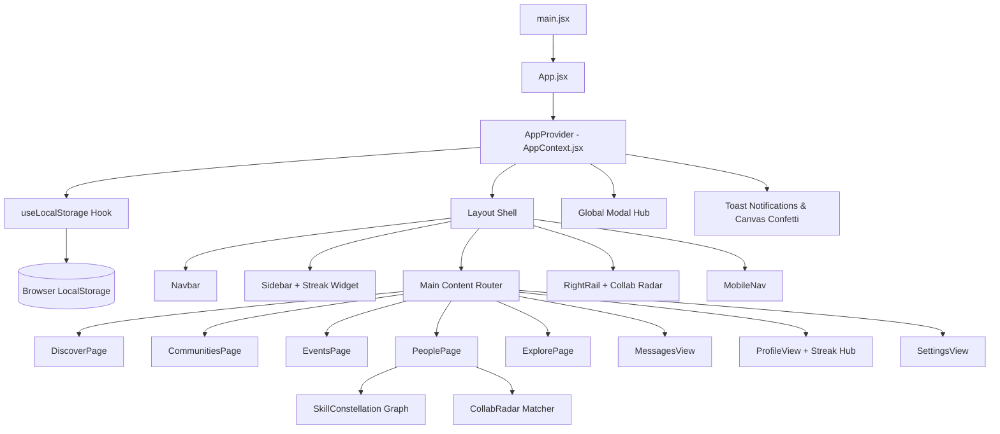

# ⚡ SYNAPSE | Reimagine Social

> **A Next-Generation Social Community Platform Built on Purposeful Participation, Collaborative Sprints, and Skill Synergy.**

[](https://react.dev/)
[](https://vitejs.dev/)
[](https://vitest.dev/)
[-10b981.svg)](https://oxc.rs/)
[](./src/styles/index.css)
[](./src/hooks/useLocalStorage.js)
[](#)

---

## 🌟 The Core Concept: "Connect by Doing, Not Just Scrolling"

Traditional social networks optimize for **passive consumption, algorithmic outrage, and vanity follower counts**. Users scroll endlessly through disjointed feeds, consuming content without genuine connection.

**SYNAPSE rethinks social connection from first principles:**
- **From Passive Scrolling to Action Sparks**: Posts are structured as *Idea Sparks*, *Collaborative Challenges*, *Interactive Polls*, *Show & Tell (Proof-of-Work)*, and *Peer Inquiries*.
- **Topic Guilds over Algorithmic Echo Chambers**: Niche, high-signal spaces (Generative AI & Shader Lab, Climate Tech, Solo Founders, Spatial Audio, Street Photography) where creators establish shared rituals, manifestos, and active sprints.
- **Participatory Challenges & Sprints**: 48-hour jams, 7-day creative coding hackathons, and photowalks with live milestone trackers, XP karma bounties, and community showcases.
- **Skill Synergy Matching**: Instead of vanity follower counts, users discover collaborators based on complementary superpowers: **"Skills Offered"** vs **"Skills Needed"** (e.g., *Offers: React & WebGL / Seeks: Rust & Audio Synthesis*).
- **Zero Backend Required**: Fully functional client-side architecture using rich mock data and a resilient `useLocalStorage` persistence layer that maintains state across browser sessions.

---

## 🌌 Groundbreaking Innovative Features

### 1. 🌌 Skill Constellation Map (2D Spatial Force-Directed Graph)
- **Concept**: Visualizes the entire creator ecosystem as an interactive starry constellation where nodes represent makers and are clustered according to skill similarity.
- **Algorithm**: A custom force-directed spring simulation that computes skill affinity vectors, pulling creators with overlapping superpowers into organic galaxies while pushing dissimilar nodes apart.
- **Interactive Mechanics**:
  - **Dynamic Connections**: Pulsing green connection lines illuminate mutual skill synergies between you and other creators.
  - **Interactive Node Exploration**: Click any star to open their synergy dossier, view who-can-help-whom, and 1-click connect or direct message.
  - **Spatial Controls**: Full zoom (+/-) and drag-to-pan viewport controls with touch gesture support for mobile devices.

### 2. 🤝 Collaboration Radar (Bidirectional Skill Matching Engine)
- **Concept**: A smart matchmaking radar that matches creators based on complementary skill gaps (*what you offer that they need ↔ what they offer that you need*).
- **Scoring Function**:
  $$\text{Score} = (\text{Offers}_{\text{You}} \cap \text{Needs}_{\text{Them}} \times 20) + (\text{Offers}_{\text{Them}} \cap \text{Needs}_{\text{You}} \times 20) + \text{MutualBonus} (25) + (\text{Interests} \times 5)$$
- **Animated Compatibility Rings**: Dynamic SVG stroke-dasharray progress circles with color-coded compatibility ratings (Green $\ge 70\%$, Purple $\ge 50\%$, Amber $\ge 30\%$).
- **Dual Presentation**: Horizontal swipeable cards in the People directory and a compact 3-match widget on the main Discover feed rail.

### 3. 🔥 Spark Streak & XP Gamification Engine
- **Concept**: Gamified participation tracking that rewards collaborative actions over passive scrolling.
- **Action Bounties**:
  - Publish an Action Spark: **+50 XP**
  - Contribute to Discussion: **+15 XP**
  - Join a Topic Guild: **+30 XP**
  - Enlist in a Challenge Sprint: **+40 XP**
- **Level Progression**: Dynamic rank tiers from *Fresh Explorer* (Lv. 1) to *Legendary Architect* (Lv. 10+), tracked with animated shimmer progress bars, confetti celebrations, and daily action checklists.

---

## 🚀 Key Platform Features

### 1. ⚡ Discover Dashboard
- **Personalized Welcome & Daily Intent Picker**: Choose your daily focus: *"All Sparks"*, *"Seeking Collabs"*, *"Live Challenges"*, or *"Proof of Work"*.
- **Innovation Spotlight**: Quick-launch hero cards for the Skill Constellation Map and Collaboration Radar with real-time streak badges.
- **Filter Bar**: Seamlessly toggle across 10 topic categories (*Technology*, *Design*, *Science*, *Startups*, *Gaming*, *Music*, *Photography*, *Art*, *Education*).
- **Multi-Faceted Sorting**: Filter by *Trending*, *Newest*, *Most Active*, or *Recommended For You*.
- **Right Rail Ecosystem Widgets**: Fast access to *Trending Guilds*, *Active Sprints*, and *Collab Radar*.

### 2. 💬 Interactive Sparks & Discussions Feed
- **Live Poll Voting**: Vote in community polls with real-time percentage calculations and visual distribution fills.
- **Micro-Interactions**: Instant like/unlike animations, bookmarking, and native clipboard link sharing with animated toast notifications.
- **Discussion Drawers**: Read peer insights and post your own comments directly into local storage.
- **Post Composer Modal**: Publish new Idea Sparks, Challenges, Community Polls, or Showcases.

### 3. 🏰 Topic Guilds & Laboratories
- **Reusable Community Cards**: Showcase cover imagery, member count, activity intensity meters (*Hyperactive*, *High*, *Active Sprints*, *Steady*), and 1-click Join/Joined states.
- **Deep Guild Hub Modal**: Explore guild manifestos, principles, active pinned sprints, and guild-exclusive discussions.
- **Community Creator**: Launch your own Guild with custom sigils, categories, guidelines, and inaugural challenges.

### 4. 🏆 Participatory Challenges & Hackathons
- **Sprint Cards**: Displays countdown timelines, difficulty rating (*Beginner Friendly*, *Intermediate*, *Advanced*), participant counters, and XP Karma bounties.
- **Event Detail & Milestones Checklist**: Track stage-by-stage progression (*Ideation*, *Prototype Build*, *Showcase*) with celebratory confetti triggers upon joining.

### 5. 🤝 Synergy Matcher & People Discovery
- **Dual View Modes**: Segmented control to toggle between classic responsive Grid view (⊞) and the 2D SVG Skill Constellation Map (🪐).
- **Search & Filter Matrix**: Search across roles, skills, and names or filter by specific technical superpowers.
- **One-Click Connect & Direct Message**.

### 6. 💬 Collaborative Chat & Messaging
- **Split-Pane Chat View**: Left thread list with real-time unread badges; right active chat with message bubbles.
- **Suggested Quick Replies**: Single-click responses (*"Let's pair on this!"*, *"Are you joining the upcoming sprint?"*).
- **Instant Message Sending**: Messages immediately append and persist in `localStorage`.
- **Edge-to-Edge Mobile Chat**: Native app feel on small viewports with dedicated back navigation and keyboard safe-area support.

### 7. 👤 Impact Profile & Karma Dashboard
- **Full Gamification Hub**: Visual streak counters, level badges, XP progress bar, and "Today's Goals" checklist.
- Visual impact statistics: *Community Karma*, *Published Sparks*, *Challenges Sprinted*, and *Guild Memberships*.
- Interactive tabs: *My Sparks*, *Joined Guilds*, *Active Sprints*, and *Saved Sparks*.
- **Edit Profile Modal**: Modify name, handle, role headline, bio, location, avatar, and skill tags with immediate persistence.

### 8. 🎨 Centralized Design System & Theme Engine
- **Three Curated Color Modes**:
  - 🌌 **Deep Slate (Dark Mode)** - Default high-contrast creative palette.
  - ☀️ **Porcelain (Light Mode)** - Clean paper-like daylight layout.
  - 🖤 **Midnight OLED** - True pure black for AMOLED screens.
- **Glassmorphic Surface Design**: Backdrop filters, subtle border glows, and tactile elevation.
- **Responsive Layout Engine**: Desktop 3-column grid, tablet 2-column view, and ergonomic mobile sticky header + bottom navigation bar.

---

## 🛠️ Architecture & Tech Stack



### Directory Structure

```text
src/
├── __tests__/               # Automated Unit Test Suite (Vitest)
│   ├── collabRadar.test.js  # Skill-matching algorithm & scoring tests
│   ├── dataSchemas.test.js  # Schema validation for all mock entities
│   └── gamification.test.js # XP, streak, and level calculation tests
├── assets/                  # Static media and brand graphics
├── components/
│   ├── common/              # Navbar, Sidebar, MobileNav, RightRail, Modal, Toasts, EmptyState, ErrorBoundary, Footer
│   ├── communities/         # CommunityCard, CommunityDetailModal, CreateCommunityModal
│   ├── constellation/       # SkillConstellation (2D force-directed SVG graph)
│   ├── events/              # EventCard, EventDetailModal
│   ├── feed/                # PostCard, CreatePostModal, PostDetailModal, FilterBar
│   ├── messages/            # MessagesView (Split chat layout & mobile view)
│   ├── notifications/       # NotificationsView
│   ├── people/              # PersonCard, ProfileDetailModal, CollabRadar
│   ├── profile/             # ProfileView, EditProfileModal, StreakXPWidget
│   └── settings/            # SettingsView
├── context/
│   └── AppContext.jsx       # Reactive global state engine & action dispatchers
├── data/                    # Realistic mock data directory
│   ├── communities.js       # 12+ Topic Guilds with metadata
│   ├── events.js            # 8+ Challenges & Sprints with milestones
│   ├── messages.js          # Chat threads and conversation histories
│   ├── notifications.js     # Categorized notification items
│   ├── posts.js             # 20+ Sparks, Polls, Showcases, Inquiries
│   ├── topics.js            # Categories, interest tags, skill tags
│   └── users.js             # 16+ User profiles with skills offered/needed
├── hooks/
│   └── useLocalStorage.js   # Fault-tolerant browser persistence hook
├── pages/
│   ├── DiscoverPage.jsx     # Main feed, hero, intent picker, innovation spotlight
│   ├── CommunitiesPage.jsx  # Guilds directory & filter tabs
│   ├── EventsPage.jsx       # Challenges, jams, and sprint milestones
│   ├── PeoplePage.jsx       # Synergy skill matcher & Constellation map
│   └── ExplorePage.jsx      # Unified search matrix across all entities
├── styles/
│   └── index.css            # Canonical design system tokens, themes, & responsive media queries
├── App.jsx                  # Main view router & modal mount hub
└── main.jsx                 # Application entrypoint
```

---

## 💻 Local Development & Automated Testing

### Prerequisites
- **Node.js**: v18.0.0 or later (v26+ tested)
- **npm**: v9.0.0 or later

### Installation & Run

1. Clone or download the repository:
   ```bash
   git clone <repository-url>
   cd "REIMAGINE SOCIAL"
   ```

2. Install dependencies:
   ```bash
   npm install
   ```

3. Run Automated Unit Tests:
   ```bash
   npm test
   ```
   Runs the complete Vitest test suite covering data integrity, gamification algorithms, and collaboration matching.

4. Run Code Quality Linter:
   ```bash
   npm run lint
   ```
   Runs Oxlint across all 49 project files (verified **0 warnings, 0 errors**).

5. Start local development server:
   ```bash
   npm run dev
   ```
   Open `http://localhost:5173/` in your browser.

6. Build for production:
   ```bash
   npm run build
   ```
   Generates the optimized production bundle in `./dist` in under 200ms.

---

## 📱 Responsive Design Matrix & Accessibility Highlights

| Viewport Tier | Width Range | Layout Adaptation |
|---|---|---|
| **Small Mobile** | 320px – 399px | Single column, compact 54px header, 100% fluid cards, safe padding |
| **Standard Mobile** | 400px – 767px | Bottom navigation bar, edge-to-edge chat viewport, 44px+ touch targets |
| **Tablet Portrait** | 768px – 899px | 2-column flex layout, fluid grid auto-fit |
| **Tablet Landscape** | 900px – 1199px | Left desktop sidebar active (260px) + flexible central content area |
| **Desktop** | 1200px – 1440px | Full 3-column layout (Sidebar + Main Feed + RightRail widgets) |
| **Ultra-wide** | 1441px+ | Centered layout with max-width containment (1380px) |

- **WCAG 2.1 AA Compliance**:
  - High APCA contrast ratios in Dark, Light, and Midnight OLED themes.
  - Interactive touch targets conform to WCAG 2.5.5 minimum 44×44px hit boundaries on touch devices.
  - Semantic HTML5 landmarks (`<header>`, `<nav>`, `<main>`, `<article>`, `<aside>`, `<footer>`).
  - Native ARIA dialog compliance for all modals (`role="dialog"`, `aria-modal="true"`, focus trapping, `Escape` key listeners).
  - `@media (prefers-reduced-motion: reduce)` support disables decorative keyframe animations for sensitive users.
  - `font-size: 16px` on inputs strictly prevents iOS browser auto-zoom.

---

## 📄 License & Credits

Crafted for the **“REIMAGINE SOCIAL”** Frontend Challenge.
Designed and engineered with passion to demonstrate next-generation community architectures, original UX, and frontend craftsmanship.
